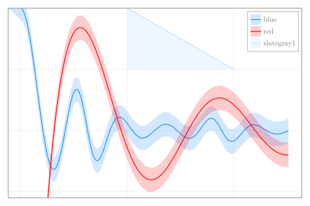

```julia
using CairoMakie, Random

x = 0:0.05:4π
y1 =  sin.(3x) ./ (cos.(x) .+ 2)./x
y2 =  -2.5cos.(x)./x
xl = LinRange(5,10,10)
yl = LinRange(1,0.5,10)

fig = Figure(size = (600, 400))
ax = Axis(fig[1,1])
lines!(x, y1; color = :dodgerblue, label = "blue")
band!(x, y1 .- 0.1, y1 .+ 0.1; color = (:dodgerblue, 0.2), label = "blue")

lines!(x, y2; color = :red, label = "red")
band!(x, y2 .- 0.1, y2 .+ 0.1; color = (:red, 0.2), label = "red")

lines!(xl, yl; color = :slategray1, label = "slategray1")
band!(xl, fill(0.5,10), yl; color= (:slategray1, 0.25),label="slategray1")
ylims!(-0.55,1)
axislegend(ax, position = :rt, merge = true)
hidedecorations!(ax; grid = false)
fig
```


```
┌ Warning: Keyword argument `bgcolor` is deprecated, use `backgroundcolor` instead.
└ @ Makie ~/.julia/packages/Makie/Qvk4f/src/makielayout/blocks/legend.jl:22
```




