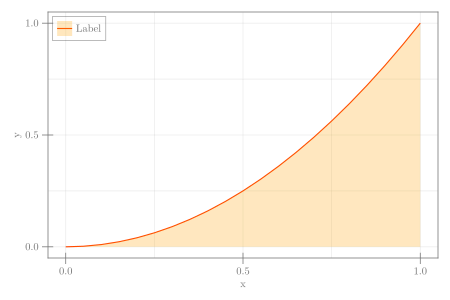

```julia
using CairoMakie

x = 0:0.05:1
y = x .^ 2
fig = Figure(size = (600, 400))
ax = Axis(fig[1, 1], xlabel = "x", ylabel = "y")
lines!(x, y, color = :orangered, label = "Label")
band!(x, fill(0, length(x)), y; color = (:orange, 0.25), label = "Label")
axislegend(; merge = true, position = :lt)
fig
```


```
┌ Warning: Keyword argument `bgcolor` is deprecated, use `backgroundcolor` instead.
└ @ Makie ~/.julia/packages/Makie/Qvk4f/src/makielayout/blocks/legend.jl:22
```




