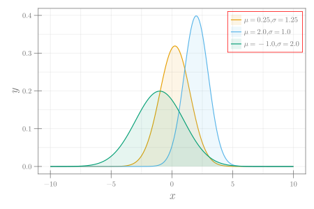

```julia
using CairoMakie

μs = [0.25, 2, -1]
σs = [1.25, 1, 2]
colors = ["#E69F00", "#56B4E9", "#009E73"]
x = LinRange(-10, 10, 200)
fg(x, μ, σ) = exp.(.-(x .- μ) .^ 2 ./ (2σ^2)) ./ (σ * √(2π))
fig = Figure(size = (600, 400), fonts= (; regular = "CMU Serif"))
ax = Axis(fig[1, 1], xlabel = L"x", ylabel = L"y", xlabelsize = 22, ylabelsize = 22)
for (idx, μ) in enumerate(μs)
    lines!(x, fg(x, μ, σs[idx]); color = colors[idx],
        label = L"\mu = %$(μ), \sigma = %$(σs[idx])")
    band!(x, fill(0, length(x)), fg(x, μ, σs[idx]); color = (colors[idx], 0.1),
        label = L"\mu = %$(μ), \sigma = %$(σs[idx])")
end
axislegend(; merge = true, framecolor = :red)
fig
```


```
┌ Warning: Keyword argument `bgcolor` is deprecated, use `backgroundcolor` instead.
└ @ Makie ~/.julia/packages/Makie/Qvk4f/src/makielayout/blocks/legend.jl:22
```




