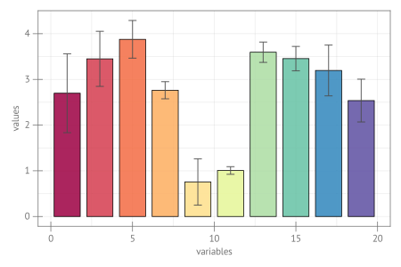

```julia
using CairoMakie, Random

Random.seed!(145)
x, y, yerr = 1:2:20, 5 * rand(10), 0.4 * abs.(randn(10))
fig = Figure(size = (600, 400), fonts = (; regular= "sans"))
ax = Axis(fig[1, 1]; xlabel = "variables", ylabel = "values")
barplot!(ax, x, y; strokewidth = 1, color = x, colormap = (:Spectral_10, 0.85),
    strokecolor = :black)
errorbars!(ax, x, y, yerr; whiskerwidth = 12)
fig
```




