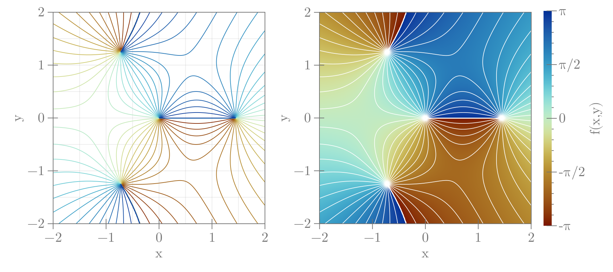

```julia
using CairoMakie

x = -2:0.005:2
y = -2:0.005:2
f(z) = (z^3 - 3) / z
fvals = [f(u + 1im * v) for u in x, v in y]
fvalues = abs.(fvals)
fargs = angle.(fvals)

fig = Figure(size=(900, 400), fontsize=20)
axs = [Axis(fig[1, j], aspect=1) for j in 1:2]
cmap = :roma
contour!(axs[1], x, y, fargs, levels=30, colormap=cmap)
pltobj1 = heatmap!(axs[2], x, y, fargs, colorrange=(-π, π), colormap=cmap)
contour!(axs[2], x, y, fargs, levels=30, color=:white, linewidth=0.85)
Colorbar(fig[1, 3], pltobj1, ticks=([-π, -π / 2, 0, π / 2, π],
    ["-π", "-π/2", "0", "π/2", "π"]))
limits!(axs[1], -2, 2, -2, 2)
fig
```




