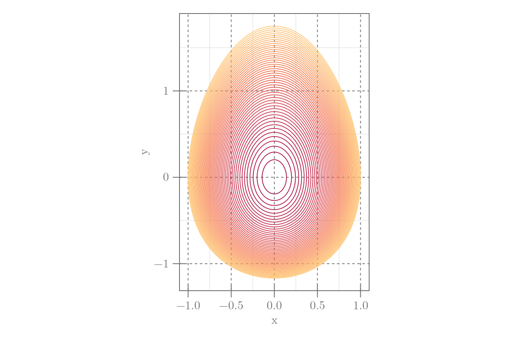

```julia
using CairoMakie, Random
x = -1:0.02:1
y = -1.5:0.02:2
egg(x, y) = x^2 + y^2 / (1.4 + y / 5)^2
segg = [egg(x, y) for x in x, y in y]

fig = Figure(size=(600, 400))
ax = Axis(fig[1, 1], aspect=DataAspect(), xlabel="x", ylabel="y",
    xgridstyle=:dash, ygridstyle=:dash,
    xgridcolor=:grey, ygridcolor=:grey)
cl = contour!(x, y, segg;
    linewidth=0.85,
    colormap=:Spectral_11,
    levels=0:0.02:1
    )
# colsize!(fig.layout, 1, Aspect(1, 0.6))
fig
```




