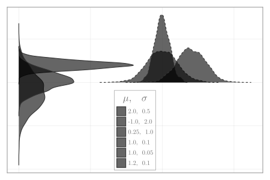

```julia
using CairoMakie, Distributions, Random

Random.seed!(124)
colors = ["#FF410D", "#6EE2FF", "#F7C530", "#95CC5E", "#D0DFE6", "#F79D1E"]
μσpairs = [[2,0.5], [-1,2], [0.25,1], [1,0.1], [1, 0.05], [1.2,0.1]]

fig = Figure(size = (600,400))
ax = Axis(fig[1,1]; palette = (; patchcolor = tuple.(colors, 0.45)))
for (idx, μσ) in enumerate(μσpairs)
    density!(rand(Normal(μσ...), 1000), strokewidth = 1.5,
        strokecolor = :grey20, direction = idx > 3 ? :x : :y,
        linestyle = idx > 3 ? :dash : :solid,
        label = "$(μσ[1]),  $(μσ[2])")
end
axislegend(L"\mu,\quad\sigma"; position= :cb, titlesize= 22)
hidedecorations!(ax; grid = false);
```


```
┌ Warning: Keyword argument `bgcolor` is deprecated, use `backgroundcolor` instead.
└ @ Makie ~/.julia/packages/Makie/Qvk4f/src/makielayout/blocks/legend.jl:22
```




