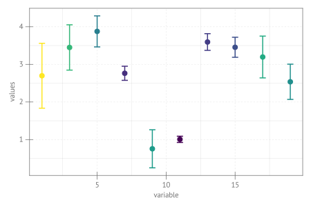

```julia
using CairoMakie, Random

Random.seed!(145)
x, y = 1:2:20, 5 * rand(10)
yerr, xerr = 0.4 * abs.(randn(10)), abs.(randn(10))
fig = Figure(size = (600, 400), fonts = (; regular= "sans"))
ax = Axis(fig[1, 1], xlabel = "variable", ylabel = "values", xgridstyle = :dash,
    ygridstyle = :dash)
errorbars!(ax, x, y, yerr; whiskerwidth = 12, color = yerr,
    linewidth = 2, colormap = :viridis)
scatter!(ax, x, y; color = yerr, colormap = :viridis, markersize = 15)
fig
```




