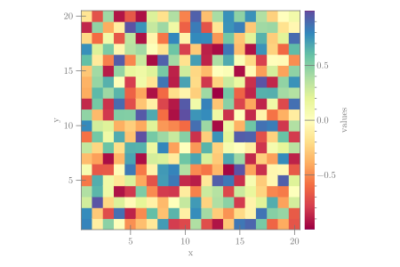

```julia
using CairoMakie, Random

Random.seed!(123)
fig = Figure(size = (600, 400))
ax = Axis(fig[1, 1]; xlabel = "x", ylabel = "y")
hmap = heatmap!(2rand(20, 20) .- 1; colormap = :Spectral_11)
Colorbar(fig[1, 2], hmap; label = "values", width = 15, ticksize = 15, tickalign = 1)
colsize!(fig.layout, 1, Aspect(1, 1.0))
colgap!(fig.layout, 7)
fig
```




