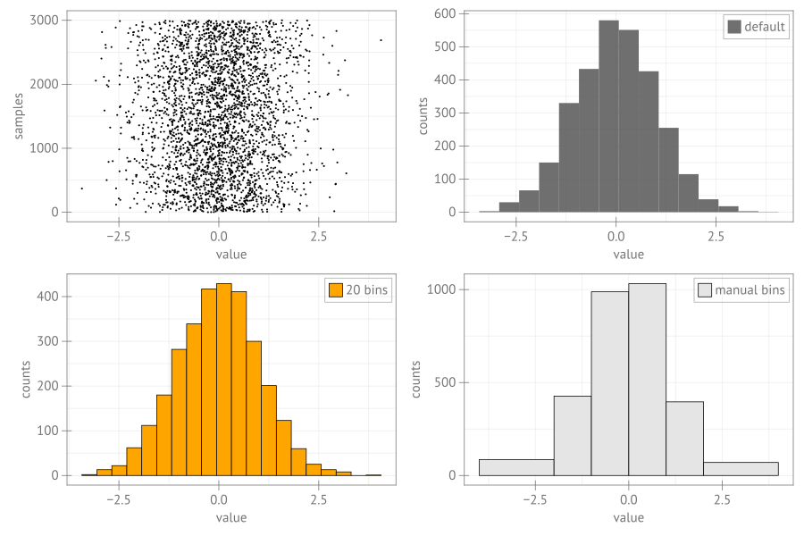

```julia
using CairoMakie, Random

Random.seed!(13)
n = 3000
data = randn(n)
fig = Figure(size = (1200, 800), fonts = (; regular= "sans"), fontsize = 20)
ax1 = Axis(fig[1, 1]; xlabel = "value", ylabel = "samples")
ax2 = Axis(fig[1, 2]; xlabel = "value", ylabel = "counts")
ax3 = Axis(fig[2, 1]; xlabel = "value", ylabel = "counts")
ax4 = Axis(fig[2, 2]; xlabel = "value", ylabel = "counts")
#scatter plot
scatter!(ax1, data, 1:n; markersize = 4, color = :black)
hist!(ax2, data; label = "default")
hist!(ax3, data; bins = 20, color = :orange, strokewidth = 1,
    strokecolor = :black, label = "20 bins")
hist!(ax4, data; bins = [-4, -2, -1, 0, 1, 2, 4], color = :gray90,
    strokewidth = 1, strokecolor = :black, label = "manual bins")
axislegend(ax2; position = :rt)
axislegend(ax3; position = :rt)
axislegend(ax4; position = :rt)
fig
```


```
┌ Warning: Keyword argument `bgcolor` is deprecated, use `backgroundcolor` instead.
└ @ Makie ~/.julia/packages/Makie/Qvk4f/src/makielayout/blocks/legend.jl:22
┌ Warning: Keyword argument `bgcolor` is deprecated, use `backgroundcolor` instead.
└ @ Makie ~/.julia/packages/Makie/Qvk4f/src/makielayout/blocks/legend.jl:22
┌ Warning: Keyword argument `bgcolor` is deprecated, use `backgroundcolor` instead.
└ @ Makie ~/.julia/packages/Makie/Qvk4f/src/makielayout/blocks/legend.jl:22
```




