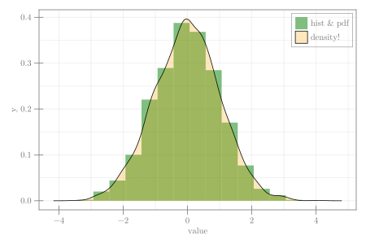

```julia
using CairoMakie, Random

Random.seed!(13)
n = 3000
data = randn(n)
fig = Figure(size = (600, 400))
ax1 = Axis(fig[1, 1], xlabel = "value")
hist!(ax1, data; normalization = :pdf, color = (:green, 0.5), label = "hist & pdf")
density!(ax1, data; color = (:orange, 0.25), label = "density!", strokewidth = 1)
axislegend(ax1, position = :rt)
fig
```


```
┌ Warning: Keyword argument `bgcolor` is deprecated, use `backgroundcolor` instead.
└ @ Makie ~/.julia/packages/Makie/Qvk4f/src/makielayout/blocks/legend.jl:22
```




