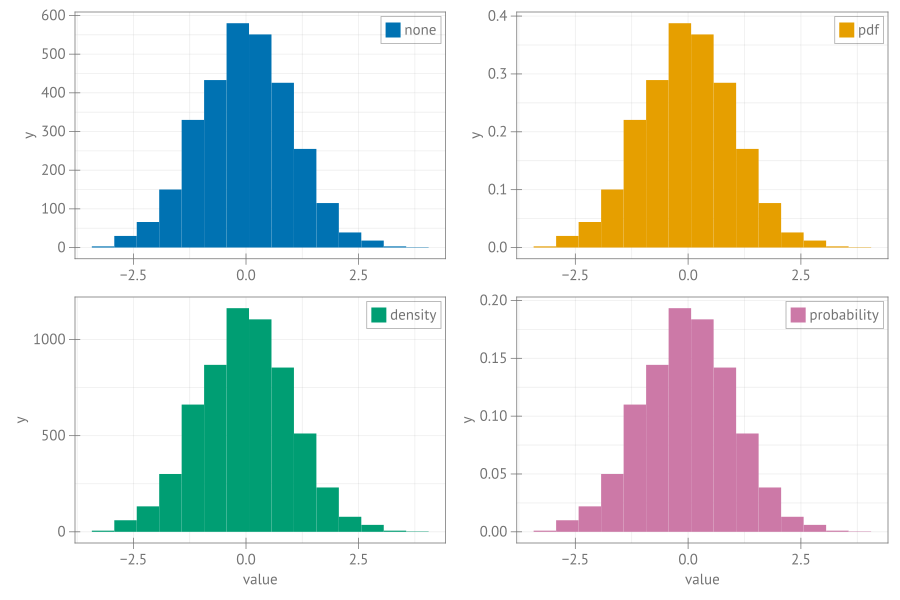

```julia
using CairoMakie, Random

Random.seed!(13)
n = 3000
data = randn(n)
normf = [:none, :pdf, :density, :probability]
colors = Makie.wong_colors()
fig = Figure(size = (1200, 800), fonts = (; regular ="sans"), fontsize = 20)
axs = [Axis(fig[i, j], xlabel = i == 2 ? "value" : "") for i in 1:2 for j in 1:2]
[hist!(axs[i], data; normalization = normf[i], color = colors[i],
    label = "$(normf[i])") for i in 1:4]
[axislegend(axs[i], position = :rt) for i in 1:4]
fig
```


```
┌ Warning: Keyword argument `bgcolor` is deprecated, use `backgroundcolor` instead.
└ @ Makie ~/.julia/packages/Makie/Qvk4f/src/makielayout/blocks/legend.jl:22
┌ Warning: Keyword argument `bgcolor` is deprecated, use `backgroundcolor` instead.
└ @ Makie ~/.julia/packages/Makie/Qvk4f/src/makielayout/blocks/legend.jl:22
┌ Warning: Keyword argument `bgcolor` is deprecated, use `backgroundcolor` instead.
└ @ Makie ~/.julia/packages/Makie/Qvk4f/src/makielayout/blocks/legend.jl:22
┌ Warning: Keyword argument `bgcolor` is deprecated, use `backgroundcolor` instead.
└ @ Makie ~/.julia/packages/Makie/Qvk4f/src/makielayout/blocks/legend.jl:22
```




