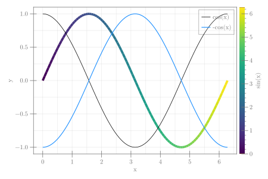

```julia
using CairoMakie, ColorSchemes

x = range(0, 2π, 100)
fig = Figure(size = (600, 400))
ax = Axis(fig[1, 1], xlabel = "x")
obj = lines!(x, sin.(x); color = x, colormap = :viridis, linewidth = 5)
lines!(x, cos.(x), color = :black, label = "cos(x)", linewidth = 1)
lines!(x, -cos.(x), color = :dodgerblue, label = "-cos(x)")
axislegend(ax)
Colorbar(fig[1, 2], obj, label = "sin(x)")
colgap!(fig.layout, 5)
fig
```


```
┌ Warning: Keyword argument `bgcolor` is deprecated, use `backgroundcolor` instead.
└ @ Makie ~/.julia/packages/Makie/Qvk4f/src/makielayout/blocks/legend.jl:22
```




