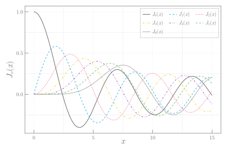

```julia
using CairoMakie, LaTeXStrings, SpecialFunctions

x = 0:0.1:15
fig = Figure(size = (600, 400), fonts =(; regular= "CMU Serif"))
ax = Axis(fig[1, 1], xlabel = L"x", ylabel = L"J_{\nu}(x)", ylabelsize = 22,
    xlabelsize = 22, xgridstyle = :dash, ygridstyle = :dash, xtickalign = 1,
    xticksize = 10, ytickalign = 1, yticksize = 10, xlabelpadding = -10)
for ν in 0:6
    lines!(ax, x, besselj.(ν, x), label = latexstring("J_{$(ν)}(x)"))
end
axislegend(; nbanks = 3, framecolor = (:grey, 0.5));
```


```
┌ Warning: Keyword argument `bgcolor` is deprecated, use `backgroundcolor` instead.
└ @ Makie ~/.julia/packages/Makie/Qvk4f/src/makielayout/blocks/legend.jl:22
```




