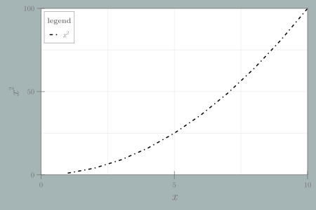

```julia
using CairoMakie

x = 1:10
lines(x, x .^ 2; color = :black, linewidth = 2, linestyle = :dashdot, label = L"x^2",
    figure = (size = (600, 400), backgroundcolor = "#a5b4b5",
        fonts = (; regular = "CMU Serif")),
    axis = (xlabel = L"x", ylabel = L"x^2", backgroundcolor = :white,
        xlabelsize = 22, ylabelsize = 22))
axislegend("legend", position = :lt)
limits!(0, 10, 0, 100)
```


```
┌ Warning: Keyword argument `bgcolor` is deprecated, use `backgroundcolor` instead.
└ @ Makie ~/.julia/packages/Makie/Qvk4f/src/makielayout/blocks/legend.jl:22
```




