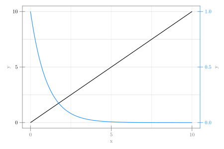

```julia
using CairoMakie

fig = Figure(size = (600, 400))
ax1 = Axis(fig[1, 1], yticklabelcolor = :black, rightspinevisible = false)
ax2 = Axis(fig[1, 1], yaxisposition = :right,
    yticklabelcolor = :dodgerblue,
    rightspinecolor = :dodgerblue,
    ytickcolor = :dodgerblue)
lines!(ax1, 0 .. 10, x -> x; color = :black)
lines!(ax2, 0 .. 10, x -> exp(-x); color = :dodgerblue)
hidespines!(ax2, :l, :b, :t)
hidexdecorations!(ax2);
```




