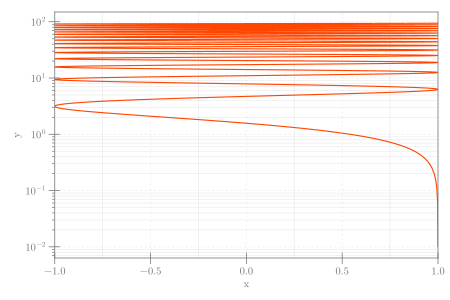

```julia
using CairoMakie

x = range(0.01, 30π, 2000)
y = cos.(x)
lines(y, x; color=:orangered, figure=(size=(600, 400),),
    axis=(yscale=log10, xlabel="x", ylabel="y", xgridstyle=:dash,
        ygridstyle=:dash, yminorticksvisible=true,
        yminorticks=IntervalsBetween(9))) ## possible issue with log-ticks
xlims!(-1, 1)
current_figure()
```




