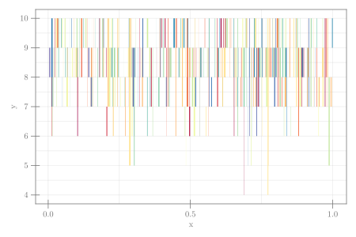

```julia
using CairoMakie, Random, Distributions
Random.seed!(1234)
b = Binomial(10, 0.85)
n = 500
function someSegments(; n = 50)
    Point2f.(vec([[x, rand(b)] for i in 1:2, x = rand(n)]))
end
linesegments(someSegments(; n = n);
    color = rand(n),
    colormap = :Spectral_11, linewidth = abs.(randn(n)),
    axis = (; xlabel = "x", ylabel = "y"),
    figure = (; size = (600,400))
    );
```




