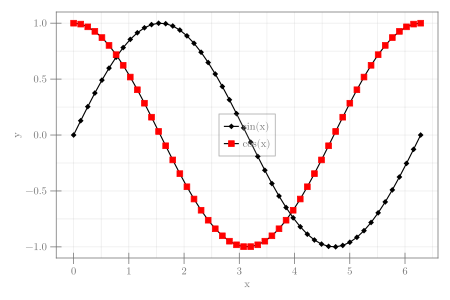

```julia
using CairoMakie

x = LinRange(0, 2π, 50)
fig = Figure(size = (600, 400))
ax = Axis(fig[1, 1], xlabel = "x")
scatterlines!(x, sin.(x), color = :black, label = "sin(x)",
    marker = '◆', markersize = 10)
scatterlines!(x, cos.(x), color = :black, label = "cos(x)",
    marker = '■', markercolor = :red, markersize = 10,
    strokewidth = 1, strokecolor = :red)
axislegend(; position = :cc)
fig
```


```
┌ Warning: Keyword argument `bgcolor` is deprecated, use `backgroundcolor` instead.
└ @ Makie ~/.julia/packages/Makie/Qvk4f/src/makielayout/blocks/legend.jl:22
```




