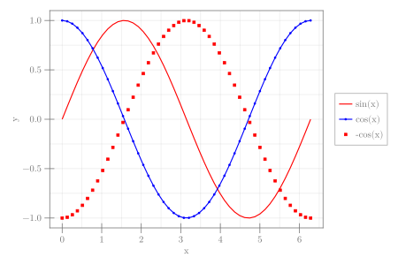

```julia
using CairoMakie

x = LinRange(0, 2π, 50)
fig = Figure(size = (600, 400))
ax = Axis(fig[1, 1], xlabel = "x")
lines!(x, sin.(x), color = :red, label = "sin(x)")
scatterlines!(x, cos.(x), color = :blue, label = "cos(x)", markersize = 5)
scatter!(x, -cos.(x), color = :red, label = "-cos(x)", strokewidth = 1,
    strokecolor = :red, markersize = 5, marker = '■')
Legend(fig[1, 2], ax, merge = true)
fig
```


```
┌ Warning: Keyword argument `bgcolor` is deprecated, use `backgroundcolor` instead.
└ @ Makie ~/.julia/packages/Makie/Qvk4f/src/makielayout/blocks/legend.jl:22
```




