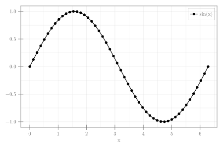

```julia
using CairoMakie

x = LinRange(0, 2π, 50)
fig = Figure(size = (600, 400))
ax = Axis(fig[1, 1], xlabel = "x", ylabel = "")
scatterlines!(x, sin.(x);
    color = :black,
    markersize = 10,
    label = "sin(x)")
axislegend()
fig
```


```
┌ Warning: Keyword argument `bgcolor` is deprecated, use `backgroundcolor` instead.
└ @ Makie ~/.julia/packages/Makie/Qvk4f/src/makielayout/blocks/legend.jl:22
```




