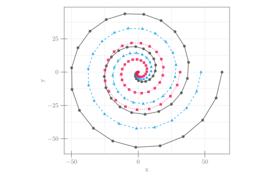

```julia
using CairoMakie
n = 50
t = range(0, 5*π, n)
x(t; a = 0.0, b = -2.4) = (a + b*t) * cos(t)
y(t; a = 0.0, b = -2.4) = (a + b*t) * sin(t)

fig = Figure(size = (600,400))
ax = Axis(fig[1,1]; aspect = DataAspect(), xlabel = "x", ylabel = "y")
for (k,i) in enumerate(-4:-2)
    scatterlines!(x.(t; b = i), y.(t; b = i))
end
fig
```




