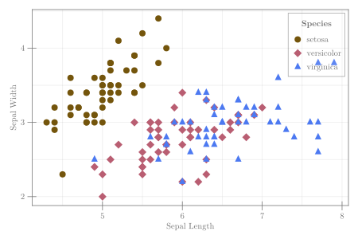

```julia
using CairoMakie, RDatasets, Random, Colors
Random.seed!(4353)
dset = dataset("datasets", "iris")
byCat = dset.Species
categ = unique(byCat)
markers = [:circle, :diamond, :utriangle]

fig = Figure(; size=(600, 400), backgroundcolor=:transparent)
ax = Axis(fig[1, 1]; xlabel="Sepal Length", ylabel="Sepal Width",
    backgroundcolor=:transparent)
for (idx, c) in enumerate(categ)
    indices = findall(x -> x == c, byCat)
    scatter!(dset.SepalLength[indices], dset.SepalWidth[indices];
        marker=markers[idx], color = rand(RGBf),
        markersize=15, label="$(c)")
end
axislegend("Species")
fig
```


```
┌ Warning: Keyword argument `bgcolor` is deprecated, use `backgroundcolor` instead.
└ @ Makie ~/.julia/packages/Makie/Qvk4f/src/makielayout/blocks/legend.jl:22
```




