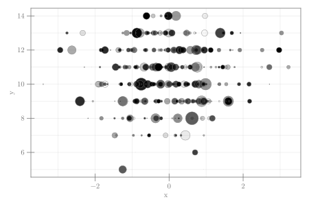

```julia
using CairoMakie, Distributions
using Random
CairoMakie.activate!(type = "svg")
Random.seed!(1234)
d = Normal()
b = Binomial(15, 0.7)
n = 350

scatter(rand(d,n), rand(b, n);
    markersize = 12*abs.(rand(d, n)),
    color = tuple.(:black, rand(n)),
    strokewidth = 0.5,
    strokecolor = :grey45,
    axis = (;
        xlabel = "x", ylabel = "y",
        ),
    figure = (;
        size = (600,400),)
    )
```




