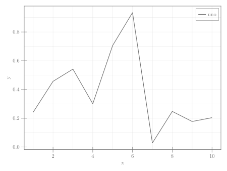

```julia
using GLMakie
fig = Figure()
ax = Axis(fig[1,1])
lines!(ax, 1:10, rand(10); label = "uno")
lg = axislegend(ax)
fig
```


```
┌ Warning: Keyword argument `bgcolor` is deprecated, use `backgroundcolor` instead.
└ @ Makie ~/.julia/packages/Makie/Qvk4f/src/makielayout/blocks/legend.jl:22
```




