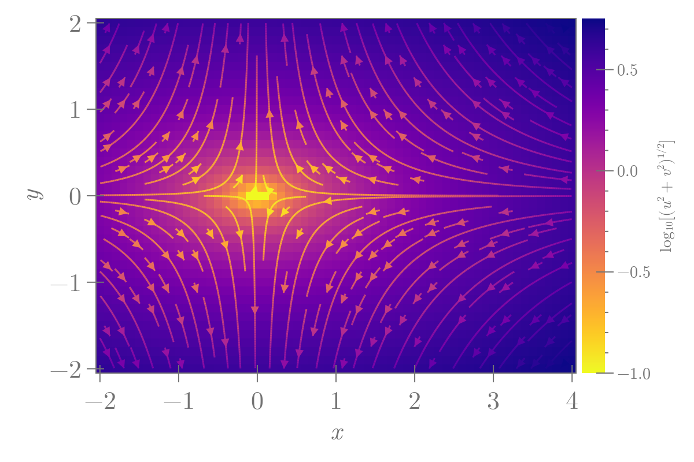

```julia
using CairoMakie

testField(x, y) = Point2f(-x, 2y) # x'(t) = -x, y'(t) = 2y
x = -2:0.1:4
y = -2:0.1:2
u2(x, y) = -x
v2(x, y) = 2y
z = [log10(sqrt(u2(x, y)^2 + v2(x, y)^2)) for x in x, y in y]

fig = Figure(size = (600, 400), fontsize = 22, fonts = (;regular="CMU Serif"))
ax = fig[1, 1] = Axis(fig, xlabel = L"x", ylabel = L"y")
fs = heatmap!(ax, x, y, z, colormap = Reverse(:plasma))
streamplot!(ax, testField, x, y, colormap = Reverse(:plasma),
    gridsize = (32, 32), arrow_size = 10)
Colorbar(fig[1, 2], fs, label = L"\log_{10}[(u^2+v^2)^{1/2}]", width = 20,
    labelsize = 14, ticklabelsize = 14)
colgap!(fig.layout, 5)
```




