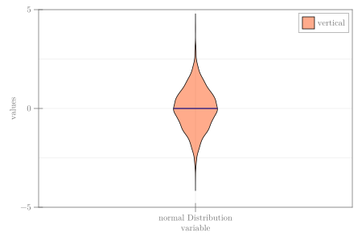

```julia
using CairoMakie, Random

Random.seed!(13)
n = 3000
data = randn(n)
a = fill(1, n)
fig = Figure(size = (600, 400))
ax = Axis(fig[1, 1], xlabel = "variable", ylabel = "values",
    xticks = ([1], ["normal Distribution"]))
violin!(ax, a, data; width = 0.35, color = (:orangered, 0.45),
    show_median = true, mediancolor = :navy, strokecolor = :black,
    strokewidth = 1, label = "vertical")
limits!(ax, 0, 2, -5, 5)
axislegend(ax, position = :rt)
fig
```


```
┌ Warning: Keyword argument `bgcolor` is deprecated, use `backgroundcolor` instead.
└ @ Makie ~/.julia/packages/Makie/Qvk4f/src/makielayout/blocks/legend.jl:22
```




