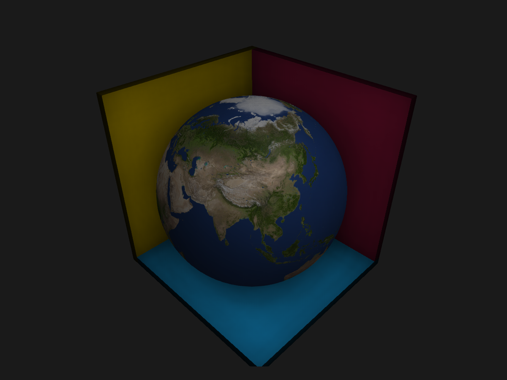

```julia
using GLMakie, Colors, LinearAlgebra
using GeometryBasics, Downloads, FileIO
GLMakie.activate!(ssao=true)
GLMakie.closeall() # close any open screen
link = "https://www.solarsystemscope.com/textures/download/8k_earth_daymap.jpg"
earth_img = load(Downloads.download(link))
function SphereTess(; o=Point3f(0), r=1, tess=64)
    return uv_normal_mesh(Tesselation(Sphere(o, r), tess))
end

function ssaoplanes()
    fig = Figure()
    ssao = Makie.SSAO(radius = 5.0, blur = 3)
    ax = LScene(fig[1, 1]; show_axis=false, scenekw=(ssao=ssao,))
    ax.scene.ssao.bias[] = 0.025
    mesh!(ax, SphereTess(; o=Point3f(0.1, 0, 0), r=0.95);
        color=circshift(earth_img, (0, 3000)), ssao=true)
    # box
    mesh!(ax, Rect3(Vec3f(-1, -1, -1.1), Vec3f(2, 2, 0.1));
        color=RGB(0.082, 0.643, 0.918), ssao=true)
    mesh!(ax, Rect3(Vec3f(-1, -1.1, -1.1), Vec3f(2, 0.1, 2.1));
        color=RGB(0.929, 0.773, 0.0), ssao=true)
    mesh!(ax, Rect3(Vec3f(-1, -1, -1.0), Vec3f(0.1, 2, 2.0));
        color=RGB(0.91, 0.122, 0.361),
        ssao=true)
    fig
end
fig = with_theme(ssaoplanes, theme_dark())
```




