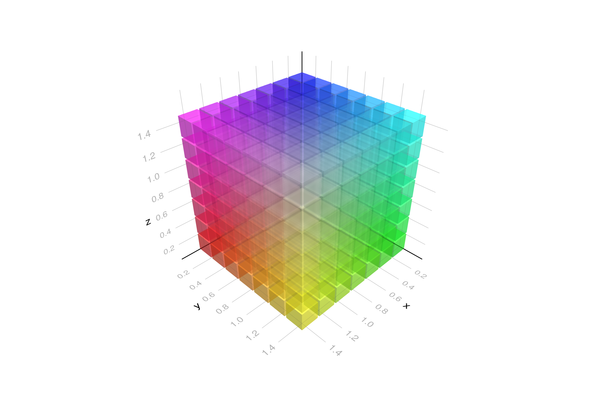

```julia
using GLMakie, Colors
using GeometryBasics: Rect3f
GLMakie.activate!()
GLMakie.closeall() # close any open screen

positions = vec([Point3f(i / 5, j / 5, k / 5) for i = 1:7, j = 1:7, k = 1:7]) ## note 7 > 5 [factor in each i,j,k], whichs is misleading

fig, ax, obj = meshscatter(positions;
    marker = Rect3f(Vec3f(-0.5), Vec3f(1.8)),
    transparency = true,
    color = [RGBA(positions[i]..., 0.5) for i in eachindex(positions)],
    figure = (;
        size = (1200, 800))
)
fig
```




