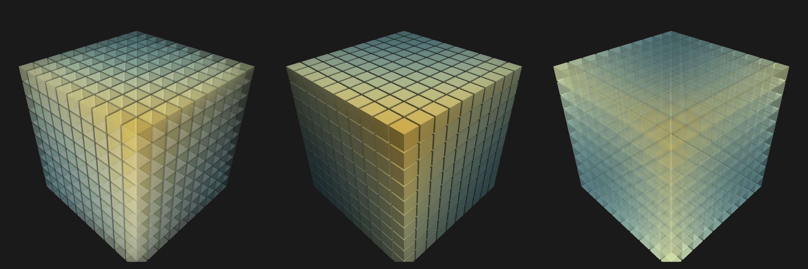

```julia
using GLMakie
GLMakie.activate!(ssao=true)
GLMakie.closeall() # close any open screen

x = y = z = 1:10
f(x, y, z) = x^2 + y^2 + z^2
positions = vec([(i, j, k) for i in x, j in y, k in z])
vals = [f(ix, iy, iz) for ix in x, iy in y, iz in z]

function ssaomeshscatter()
    colormap = :starrynight
    fig = Figure(size=(1800, 600))
    ssao = Makie.SSAO(radius = 6.0, blur = 3)
    ax11 = LScene(fig[1, 1]; show_axis=false, scenekw=(ssao=ssao,))
    ax11.scene.ssao.bias[] = 0.025
    ax12 = LScene(fig[1, 2]; show_axis=false, scenekw=(ssao=ssao,))
    ax13 = LScene(fig[1, 3]; show_axis=false, scenekw=(ssao=ssao,))
    meshscatter!(ax11, positions, color=vec(vals),
        marker=Rect3f(Vec3f(-0.5), Vec3f(1)),
        markersize=0.9,
        colormap=(colormap, 0.5),
        colorrange=(minimum(vals), maximum(vals)),
        backlight=4.0f0,
        ssao=true,
    )
    meshscatter!(ax12, positions; color=vec(vals),
        marker=Rect3f(Vec3f(-0.5), Vec3f(1)),
        markersize=0.9,
        colormap,
        colorrange=(minimum(vals), maximum(vals)),
        ssao=true
    )
    meshscatter!(ax13, positions; color=vec(vals),
        marker=Rect3f(Vec3f(-0.5), Vec3f(1)),
        markersize=0.9,
        colormap,
        colorrange=(minimum(vals), maximum(vals)),
        backlight=2.0f0,
        ssao=true,
        transparency=true
    )
    zoom!(ax11.scene, cameracontrols(ax11.scene), 1.2)
    zoom!(ax12.scene, cameracontrols(ax12.scene), 1.2)
    zoom!(ax13.scene, cameracontrols(ax13.scene), 1.2)
    fig
end
with_theme(ssaomeshscatter, theme_dark())
```




