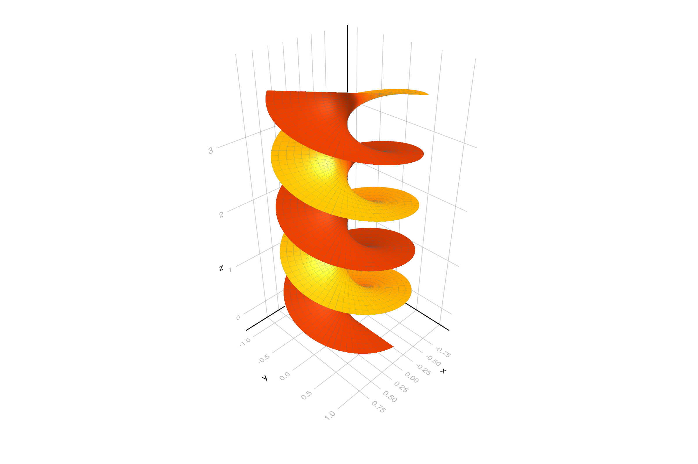

```julia
using GLMakie
GLMakie.activate!()
GLMakie.closeall() # close any open screen

t = 0:0.1:15
u = -1:0.1:1
x = [u * sin(t) for t in t, u in u]
y = [u * cos(t) for t in t, u in u]
z = [t / 4 for t in t, u in u]
fig = surface(x, y, z; colormap = [:orangered, :orangered],
    lightposition = Vec3f(0, 0, 0), ambient = Vec3f(0.65, 0.65, 0.65),
    backlight = 5.0f0, figure = (; size = (1200, 800)))
wireframe!(x, y, z, overdraw = false, linewidth = 0.1) # try overdraw = true
fig
```




