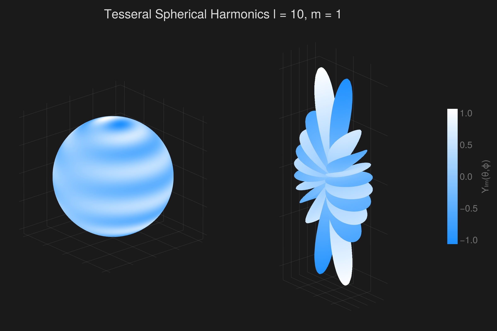

```julia
using GLMakie
using AssociatedLegendrePolynomials
GLMakie.activate!()
GLMakie.closeall() # close any open screen

function Y(θ, ϕ, l, m)
    if m < 0
        return (-1)^m * √2 * Nlm(l, abs(m)) * Plm(l, abs(m), cos(θ)) * sin(abs(m) * ϕ)
    elseif m == 0
        return sqrt((2 * l + 1) / 4π) * Plm(l, m, cos(θ))
    else
        return (-1)^m * √2 * Nlm(l, m) * Plm(l, m, cos(θ)) * cos(m * ϕ)
    end
end
# Grids of polar and azimuthal angles
θ = LinRange(0, π, 200)
ϕ = LinRange(0, 2π, 200)
x = [sin(θ) * sin(ϕ) for θ in θ, ϕ in ϕ]
y = [sin(θ) * cos(ϕ) for θ in θ, ϕ in ϕ]
z = [cos(θ) for θ in θ, ϕ in ϕ]
l = 10
m = 1
Ygrid = [Y(θ, ϕ, l, m) for θ in θ, ϕ in ϕ]
Ylm = abs.(Ygrid)
cmap = [:dodgerblue, :white]

with_theme(theme_dark()) do
    fig = Figure(size = (1200, 800), fontsize = 22)
    axs = [Axis3(fig[1, j], aspect = :data) for j in 1:2]
    pltobj = surface!(axs[1], x, y, z; color = Ygrid,
        colormap = cmap,
        shading = NoShading)
    surface!(axs[2], Ylm .* x, Ylm .* y, Ylm .* z;
        color = Ygrid,
        colormap = cmap,
        shading = NoShading)
    Colorbar(fig[1, 3], pltobj, label = "Yₗₘ(θ,ϕ)", tickwidth = 2, tickalign = 1,
        width = 25, ticksize = 25, height = Relative(0.5))
    fig[0, 1:2] = Label(fig, "Tesseral Spherical Harmonics l = $(l), m = $(m)",
        fontsize = 30, color = (:white, 0.85))
    hidedecorations!.(axs; grid = false)
    fig
end
```




