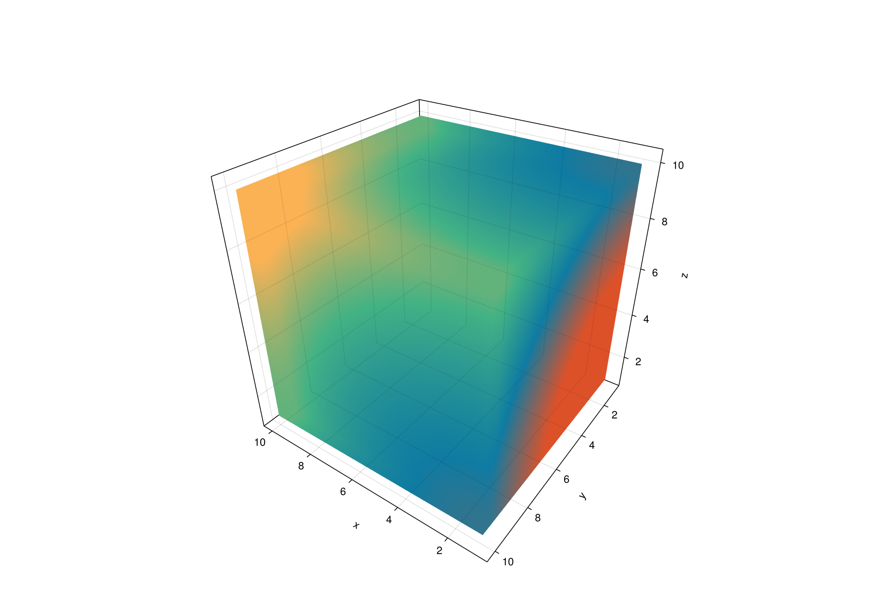

```julia
using GLMakie, ColorSchemes
GLMakie.activate!()
GLMakie.closeall() # close any open screen

x = y = z = 1:10
f(x, y, z) = x^2 + y^2 + z^2
vol = [f(ix, iy, iz) for ix in x, iy in y, iz in z]
fig, ax, _ = volume(x, y, z, vol;
    colorrange = (minimum(vol), maximum(vol)),
    colormap = :Egypt, transparency = true,
    figure = (; size = (1200, 800)),
    axis = (;
        type = Axis3,
        perspectiveness = 0.5,
        azimuth = 2.19,
        elevation = 0.57,
        aspect = (1, 1, 1)
        )
    )
fig
```




