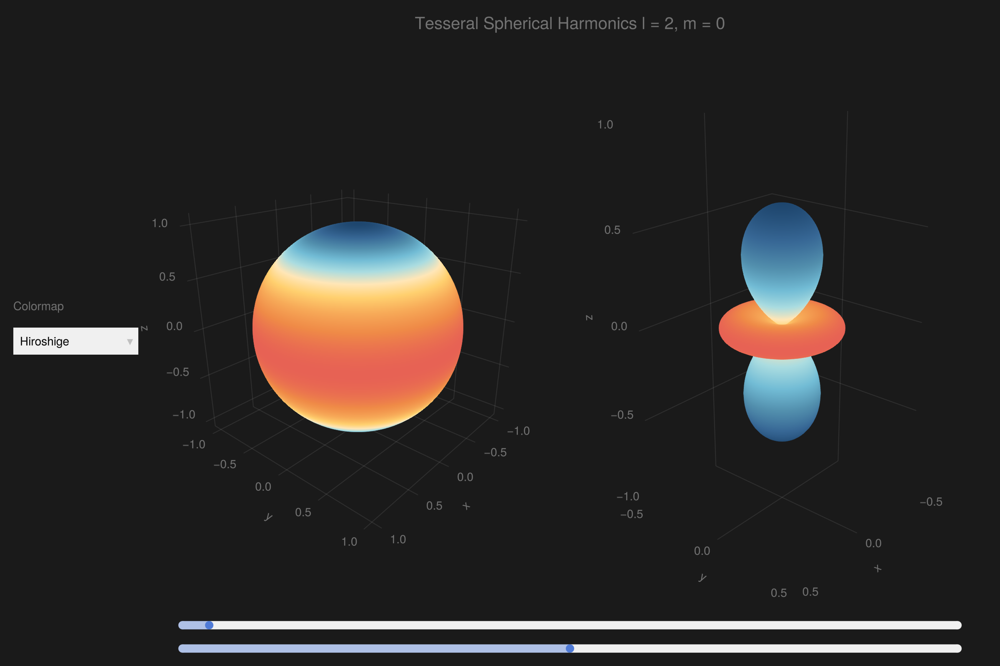

```julia
using GLMakie, ColorSchemes
using AssociatedLegendrePolynomials
GLMakie.activate!()
GLMakie.closeall() # close any open screen

function Y(θ, ϕ, l, m)
    if m < 0
        return (-1)^m * √2 * Nlm(l, abs(m)) * Plm(l, abs(m), cos(θ)) * sin(abs(m) * ϕ)
    elseif m == 0
        return sqrt((2 * l + 1) / 4π) * Plm(l, m, cos(θ))
    else
        return (-1)^m * √2 * Nlm(l, m) * Plm(l, m, cos(θ)) * cos(m * ϕ)
    end
end
# Grids of polar and azimuthal angles
θ = LinRange(0, π, 200)
ϕ = LinRange(0, 2π, 200)
x = [sin(θ) * sin(ϕ) for θ in θ, ϕ in ϕ]
y = [sin(θ) * cos(ϕ) for θ in θ, ϕ in ϕ]
z = [cos(θ) for θ in θ, ϕ in ϕ]
l = Observable(4)
m = Observable(1)
cmap = "Hiroshige"

with_theme(theme_dark()) do
    fig = Figure(size = (1200, 800))
    menu = Menu(fig, options = ["Hiroshige", "Spectral_11", "diverging_bkr_55_10_c35_n256",
        "diverging_cwm_80_100_c22_n256", ":diverging_gkr_60_10_c40_n256",
        "diverging_linear_bjr_30_55_c53_n256",
        "diverging_protanopic_deuteranopic_bwy_60_95_c32_n256"])
    Ygrid = lift(l, m) do l, m
        [Y(θ, ϕ, l, m) for θ in θ, ϕ in ϕ]
    end
    Ylm = @lift(abs.($Ygrid))
    Ygrid2 = @lift(vec($Ygrid))

    ax1 = Axis3(fig[1, 1], aspect = :data, perspectiveness = 0.5, elevation = π / 8, azimuth = 2.225π)
    ax2 = Axis3(fig[1, 2], aspect = :data, perspectiveness = 0.5, elevation = π / 8, azimuth = 2.225π)
    pltobj1 = surface!(ax1, x, y, z; color = Ygrid, colormap = cmap, shading = NoShading)
    pltobj2 = surface!(ax2, @lift($Ylm .* x), @lift($Ylm .* y), @lift($Ylm .* z), color = Ygrid,
        colormap = cmap, shading = NoShading)
    limits!(ax2, -0.5, 0.5, -0.5, 0.5, -1, 1)
    # cbar = Colorbar(fig[1, 3], pltobj1, label = "Yₗₘ(θ,ϕ)", width = 11, tickalign = 1, tickwidth = 1)
    fig[0, 1:2] = GLMakie.Label(fig, @lift("Tesseral Spherical Harmonics l = $($l), m = $($m)"), fontsize = 20)
    fig[1, 0] = vgrid!(
        GLMakie.Label(fig, "Colormap", width = nothing),
        menu; tellheight = false, width = 150)
    on(menu.selection) do s
        pltobj1.colormap = s
        pltobj2.colormap = s
    end
    sl = Slider(fig[end+1, 1:2], range = 1:30, startvalue = 2)
    sl2 = Slider(fig[end+1, 1:2], range = @lift(-$(sl.value):1:$(sl.value)))
    connect!(l, sl.value)
    connect!(m, sl2.value)
    # tight_ticklabel_spacing!(cbar)
    # display(fig)
    fig
end
```




