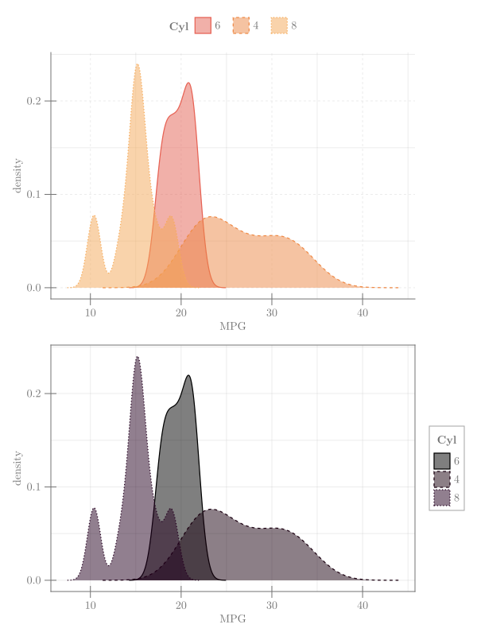

## density mtcars {#density-mtcars}





```julia
using CairoMakie, RDatasets, Colors, ColorSchemes

cars = dataset("datasets", "mtcars")
byCat = cars.Cyl
categ = unique(byCat)
colors1 = categorical_colors(:Hiroshige, length(categ))
colors2 = categorical_colors(:gnuplot, length(categ))

fig = Figure(; size = (600, 800))
ax1 = Axis(fig[2, 1], xlabel = "MPG", ylabel = "density", xgridstyle = :dash,
    ygridstyle = :dash, rightspinevisible = false, topspinevisible = false)
ax2 = Axis(fig[3, 1], xlabel = "MPG", ylabel = "density")
for (i, c) in enumerate(categ)
    indc = findall(x -> x == c, byCat)
    density!(ax1, cars.MPG[indc]; color = (colors1[i], 0.5), label = "$(c)",
        strokewidth = 1.25, strokecolor = colors1[i])
    density!(ax2, cars.MPG[indc], color = (colors2[i], 0.5), label = "$(c)",
        strokewidth = 1.25, strokecolor = colors2[i])
end
Legend(fig[1, 1], ax1, "Cyl", orientation = :horizontal,
    tellheight = true, tellwidth = false,
    framevisible = false, titleposition = :left)
Legend(fig[3, 2], ax2, "Cyl")
fig
```


```ansi
┌ Warning: Using a `Vector{<:Real}` as a linestyle attribute is deprecated. Wrap it in a `Linestyle`.
└ @ Makie ~/.julia/packages/Makie/HyJrI/src/conversions.jl:1161
┌ Warning: Using a `Vector{<:Real}` as a linestyle attribute is deprecated. Wrap it in a `Linestyle`.
└ @ Makie ~/.julia/packages/Makie/HyJrI/src/conversions.jl:1161
┌ Warning: Using a `Vector{<:Real}` as a linestyle attribute is deprecated. Wrap it in a `Linestyle`.
└ @ Makie ~/.julia/packages/Makie/HyJrI/src/conversions.jl:1161
┌ Warning: Using a `Vector{<:Real}` as a linestyle attribute is deprecated. Wrap it in a `Linestyle`.
└ @ Makie ~/.julia/packages/Makie/HyJrI/src/conversions.jl:1161
┌ Warning: Using a `Vector{<:Real}` as a linestyle attribute is deprecated. Wrap it in a `Linestyle`.
└ @ Makie ~/.julia/packages/Makie/HyJrI/src/conversions.jl:1161
┌ Warning: Using a `Vector{<:Real}` as a linestyle attribute is deprecated. Wrap it in a `Linestyle`.
└ @ Makie ~/.julia/packages/Makie/HyJrI/src/conversions.jl:1161
┌ Warning: Using a `Vector{<:Real}` as a linestyle attribute is deprecated. Wrap it in a `Linestyle`.
└ @ Makie ~/.julia/packages/Makie/HyJrI/src/conversions.jl:1161
┌ Warning: Using a `Vector{<:Real}` as a linestyle attribute is deprecated. Wrap it in a `Linestyle`.
└ @ Makie ~/.julia/packages/Makie/HyJrI/src/conversions.jl:1161
```

