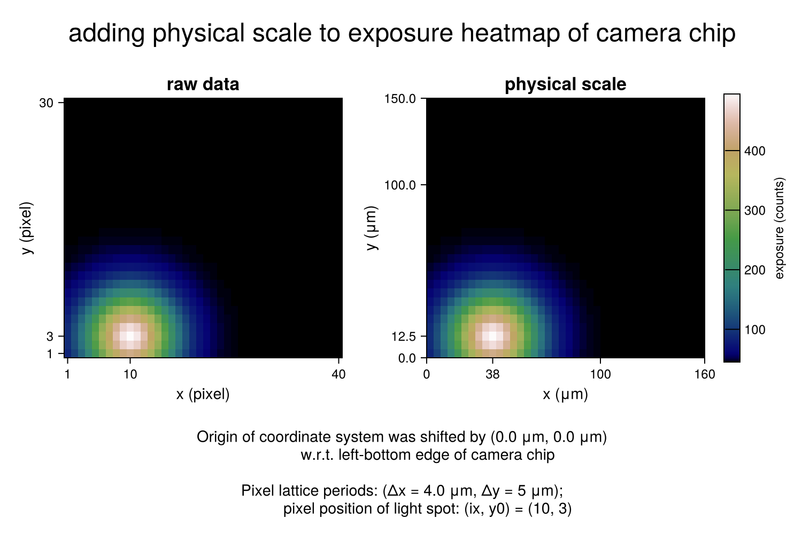
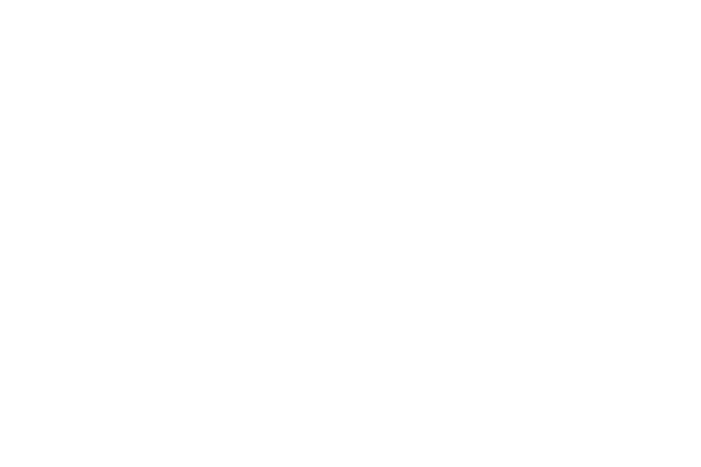

## heatmap: scales added {#heatmap:-scales-added}





by @walra356

```julia
using CairoMakie

supertitle = "adding physical scale to exposure heatmap of camera chip"
```


```ansi
"adding physical scale to exposure heatmap of camera chip"
```


define transformation from pixel coordinates to physical coordinates

```julia
edges(p, Δx, x0) = collect(p .* Δx) .- (x0 + 0.5Δx)
```


```ansi
edges (generic function with 1 method)
```


parameters camera chip (pixel coordinates)

```julia
dimX = 40
dimY = 30                        # pixel dimensions camera chip
(px, py) = (1:dimX, 1:dimY)                 # pixel positions
(ix, iy) = (10, 3)                          # selected pixel
```


```ansi
(10, 3)
```


physical coordinates

```julia
(Δx, Δy) = (4.0, 5, 0)                       # pixel lattice periods (μm)
(Ox, Oy) = (0.0, 0.0)                           # manual offset (μm)
(x, y) = (edges(px, Δx, Ox), edges(py, Δy, Oy)) # pixel positions (μm)
```


```ansi
([2.0, 6.0, 10.0, 14.0, 18.0, 22.0, 26.0, 30.0, 34.0, 38.0  …  122.0, 126.0, 130.0, 134.0, 138.0, 142.0, 146.0, 150.0, 154.0, 158.0], [2.5, 7.5, 12.5, 17.5, 22.5, 27.5, 32.5, 37.5, 42.5, 47.5  …  102.5, 107.5, 112.5, 117.5, 122.5, 127.5, 132.5, 137.5, 142.5, 147.5])
```


create exposure matrix σ (model alternative for measurement file)

```julia
valmax = 500.0                              # maximum value exposure matrix
exposure(i, j, ix, iy, wx, wy) = 0.9valmax *
                                  (exp(-(((i - ix) / wx)^2 + ((Δy / Δx) * (j - iy) / wy)^2)) + 0.1)
σ = round.(Int, [exposure(i, j, ix, iy, 6, 6) for i = 1:dimX, j = 1:dimY])
σ = σ[px, py]                                # exposure matrix
footnote = "Origin of coordinate system was shifted by ($Ox μm, $Oy μm)
            w.r.t. left-bottom edge of camera chip
            \nPixel lattice periods: (Δx = $Δx μm, Δy = $Δy μm);
            pixel position of light spot: (ix, y0) = ($(ix), $(iy))"
```


```ansi
"Origin of coordinate system was shifted by (0.0 μm, 0.0 μm)\n            w.r.t. left-bottom edge of camera chip\n            \nPixel lattice periods: (Δx = 4.0 μm, Δy = 5 μm);\n            pixel position of light spot: (ix, y0) = (10, 3)"
```


start actual plot

```julia
theme = Theme(fontsize = 12, colormap = :gist_earth, ; size = (750, 500))
set_theme!(theme)

fig = Figure()
```

{width=750px height=500px}

specify attributes

```julia
fsize = fig.scene.theme.fontsize.val
fres = fig.scene.theme.size.val[1]
attr = (xlabelsize = 6fsize / 5, ylabelsize = 6fsize / 5, titlesize = 7fsize / 5,
  xautolimitmargin = (0, 0), yautolimitmargin = (0, 0),)
attr1 = (attr..., title = "raw data",
  xticks = [px[1], ix, px[end]], yticks = [py[1], iy, py[end]],
  xlabel = "x (pixel)", ylabel = "y (pixel)",
  aspect = (Δx * size(σ, 1)) / (Δy * size(σ, 2)),)
attr2 = (attr..., title = "physical scale",
  xticks = [x[1] - Δx / 2, x[ix], 100, x[end] + Δx / 2],
  yticks = [y[1] - Δy / 2, y[iy], 100, y[end] + Δy / 2],
  xlabel = "x (μm)", ylabel = "y (μm)",
  aspect = (Δx * size(σ, 1)) / (Δy * size(σ, 2)),)
attr4 = (label = "exposure (counts)", ticksize = 6fsize / 5, tickalign = 1,
  width = 15, height = Relative(0.98),) # tweaked
```


```ansi
(label = "exposure (counts)", ticksize = 14.4, tickalign = 1, width = 15, height = Relative(0.98f0))
```


create axes, add contents

```julia
ax1 = Axis(fig; attr1...)
ax2 = Axis(fig; attr2...)
hm1 = heatmap!(ax1, px, py, σ)
hm2 = heatmap!(ax2, x, y, σ)
ax4 = Colorbar(fig, hm1; attr4...)
axn = Label(fig, text = footnote, fontsize = 6fsize / 5)
axt = Label(fig, text = supertitle, fontsize = 2fsize)
```


```ansi
Label()
```


create layout and show figure

```julia
fig[1, 1] = ax1
fig[1, 2] = ax2
fig[1, 3] = ax4
fig[2, :] = axn
fig[0, :] = axt
fig
```

