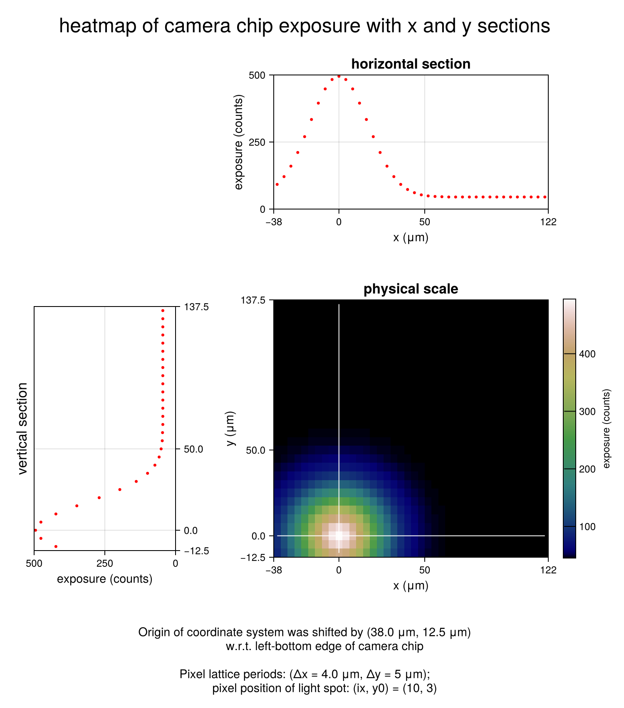

## heatmap: scale sections {#heatmap:-scale-sections}





by @walra356

```julia
using CairoMakie

supertitle = "heatmap of camera chip exposure with x and y sections"
```


```ansi
"heatmap of camera chip exposure with x and y sections"
```


define transformation from pixel coordinates to physical coordinates

```julia
edges(p, Δx, x0) = collect(p .* Δx) .- (x0 + 0.5Δx)
```


```ansi
edges (generic function with 1 method)
```


parameters camera chip (pixel coordinates)

```julia
dimX = 40
dimY = 30                       # pixel dimensions
(px, py) = (1:dimX, 1:dimY)                  # pixel positions
(ix, iy) = (10, 3)                        # selected pixel
```


```ansi
(10, 3)
```


physical coordinates

```julia
(Δx, Δy) = (4.0, 5, 0)                       # pixel lattice periods (μm)
(Ox, Oy) = (edges(ix, Δx, 0), edges(iy, Δy, 0)) # manual offset (μm)
(x, y) = (edges(px, Δx, Ox), edges(py, Δy, Oy)) # pixel positions (μm)
```


```ansi
([-36.0, -32.0, -28.0, -24.0, -20.0, -16.0, -12.0, -8.0, -4.0, 0.0  …  84.0, 88.0, 92.0, 96.0, 100.0, 104.0, 108.0, 112.0, 116.0, 120.0], [-10.0, -5.0, 0.0, 5.0, 10.0, 15.0, 20.0, 25.0, 30.0, 35.0  …  90.0, 95.0, 100.0, 105.0, 110.0, 115.0, 120.0, 125.0, 130.0, 135.0])
```


create exposure matrix σ (model alternative for measurement file)

```julia
valmax = 500.0                              # maximum value exposure matrix
exposure(i, j, ix, iy, wx, wy) = 0.9valmax *
                                  (exp(-(((i - ix) / wx)^2 + ((Δy / Δx) * (j - iy) / wy)^2)) + 0.1)
σ = round.(Int, [exposure(i, j, ix, iy, 6, 6) for i = 1:dimX, j = 1:dimY])
σ1 = σ[px, py]  # raw matrix
sh = σ[:, iy]   # horizontal section (pixel row iy from bottom)
sv = σ[ix, :]   # vertical section (pixel column ix from left)
footnote = "Origin of coordinate system was shifted by ($Ox μm, $Oy μm)
            w.r.t. left-bottom edge of camera chip
            \nPixel lattice periods: (Δx = $Δx μm, Δy = $Δy μm);
            pixel position of light spot: (ix, y0) = ($(ix), $(iy))"
```


```ansi
"Origin of coordinate system was shifted by (38.0 μm, 12.5 μm)\n            w.r.t. left-bottom edge of camera chip\n            \nPixel lattice periods: (Δx = 4.0 μm, Δy = 5 μm);\n            pixel position of light spot: (ix, y0) = (10, 3)"
```


start actual plot

```julia
theme = Theme(fontsize = 12, colormap = :gist_earth, ; size = (750, 850))
set_theme!(theme)
fig = Figure()
```

{width=750px height=850px}

collect attributes

```julia
fsize = fig.scene.theme.fontsize.val
fresx = fig.scene.theme.size.val[1]
fresy = fig.scene.theme.size.val[2]
attr = (xlabelsize = 6fsize / 5, ylabelsize = 6fsize / 5, titlesize = 7fsize / 5,
  xautolimitmargin = (0, 0), yautolimitmargin = (0, 0),)
attr1 = (attr..., title = "physical scale",
  xticks = [x[1] - Δx / 2, x[ix], 50, x[end] + Δx / 2],
  yticks = [y[1] - Δy / 2, y[iy], 50, y[end] + Δy / 2],
  xlabel = "x (μm)", ylabel = "y (μm)",
  aspect = (Δx * size(σ1, 1)) / (Δy * size(σ1, 2)),)
attrc = (label = "exposure (counts)", ticksize = 6fsize / 5, tickalign = 1,
  width = 15, height = Relative(0.88),) # tweaked
attrh = (attr..., title = "horizontal section",
  xlabel = "x (μm)", ylabel = "exposure (counts)",
  xticks = [x[1] - Δx / 2, x[ix], 50, x[end] + Δx / 2],
  yticks = [0, 250, valmax],
  limits = ((x[1] - Δx / 2, x[end] + Δx / 2), (0, valmax)),
  height = fresy / 5, aspect = 2.05,) # tweaked
attrv = (attr..., xlabel = "exposure (counts)",
  xticks = [0, 250, valmax],
  yticks = [y[1] - Δy / 2, y[iy], 50, y[end] + Δy / 2],
  xreversed = true, yaxisposition = :right,
  limits = ((0, valmax), (y[1] - Δy / 2, y[end] + Δy / 2)),
  width = fresy / 5, aspect = 0.58,) # tweaked
```


```ansi
(xlabelsize = 14.4, ylabelsize = 14.4, titlesize = 16.8, xautolimitmargin = (0, 0), yautolimitmargin = (0, 0), xlabel = "exposure (counts)", xticks = [0.0, 250.0, 500.0], yticks = [-12.5, 0.0, 50.0, 137.5], xreversed = true, yaxisposition = :right, limits = ((0, 500.0), (-12.5, 137.5)), width = 170.0, aspect = 0.58)
```


create axes and add contents

```julia
ax1 = Axis(fig; attr1...)
axh = Axis(fig; attrh...)
axv = Axis(fig; attrv...)
hm1 = heatmap!(ax1, x, y, σ1)
axc = Colorbar(fig, hm1; attrc...)
lfn = Label(fig, text = footnote, fontsize = 6fsize / 5)
lst = Label(fig, text = supertitle, fontsize = 2fsize)
lvs = Label(fig, text = "vertical section", padding = (0, 5, 0, 0),
  rotation = pi / 2, fontsize = 7fsize / 5)
sch = scatter!(axh, x, sh, color = :red, markersize = 5,)
scv = scatter!(axv, sv, y, color = :red, markersize = 5)
lnh = lines!(ax1, x, fill(0, length(x)), color = :white, linewidth = 1)
lnv = lines!(ax1, fill(0, length(y)), y, color = :white, linewidth = 1)
```


```ansi
Lines{Tuple{Vector{Point{2, Float64}}}}
```


create layout and show figure

```julia
fig[1, 2] = axh
fig[2, 1] = axv
fig[2, 1, Left()] = lvs
fig[2, 2] = ax1
fig[2, 3] = axc
fig[3, :] = lfn
fig[0, :] = lst
fig
```

