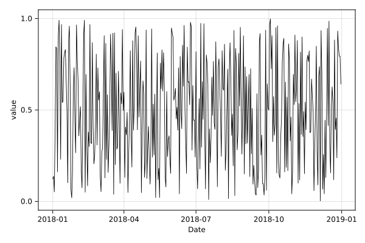

## Time ticks on x axis {#Time-ticks-on-x-axis}





```julia
using CairoMakie, TimeSeries, Dates
# dummy data
dates = Date(2018, 1, 1):Day(1):Date(2018, 12, 31)
ta = TimeArray(dates, rand(length(dates)))

fig = Figure(size=(600, 400), fonts=(;regular = "sans"))
ax = Axis(fig[1, 1], xlabel="Date", ylabel="value")
line1 = lines!(ax, timestamp(ta), values(ta); color=:black, linewidth=0.85)
```


```ansi
Lines{Tuple{Vector{Point{2, Float64}}}}
```


ax.xticklabelrotation = π / 4 ax.xticklabelalign = (:right, :center)

```julia
fig
```

