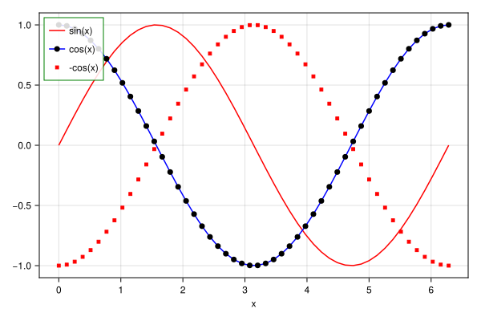

## scatterlines + scatter with legend inside {#scatterlines-scatter-with-legend-inside}





```julia
using CairoMakie

x = LinRange(0, 2π, 50)
fig = Figure(size = (600, 400))
ax = Axis(fig[1, 1], xlabel = "x")
lines!(x, sin.(x); color = :red, label = "sin(x)")
scatterlines!(x, cos.(x); color = :blue, label = "cos(x)", markercolor = :black,
    markersize = 10)
scatter!(x, -cos.(x); color = :red, label = "-cos(x)", strokewidth = 1,
    strokecolor = :red, markersize = 5, marker = '■')
axislegend(; position = :lt, backgroundcolor = (:white, 0.85), framecolor = :green);
```

