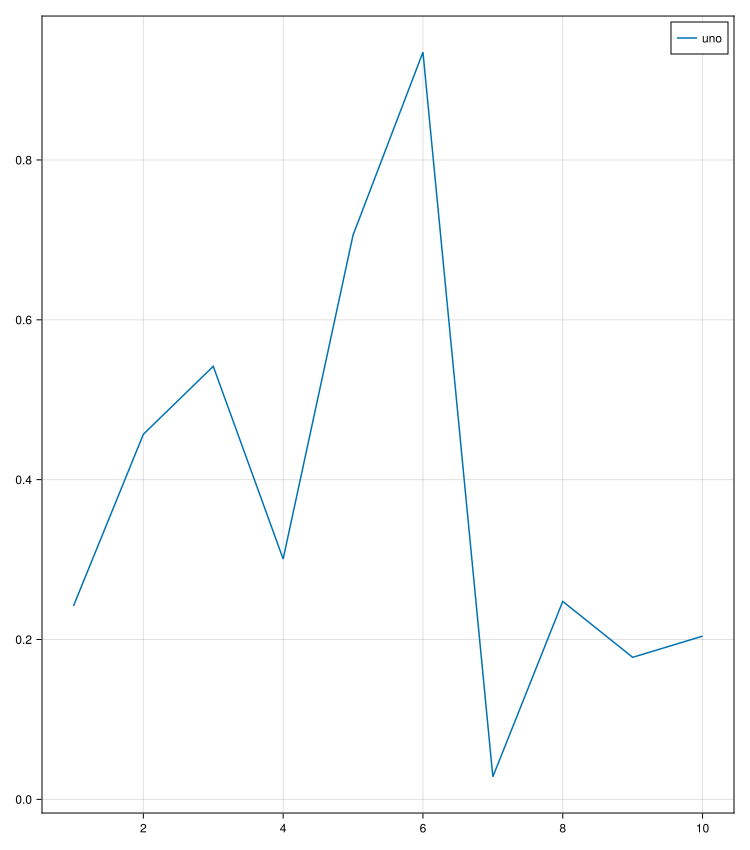

## scatters and axislegend: Legend inside {#scatters-and-axislegend:-Legend-inside}





```julia
using GLMakie
fig = Figure()
ax = Axis(fig[1,1])
lines!(ax, 1:10, rand(10); label = "uno")
lg = axislegend(ax)
fig
```

