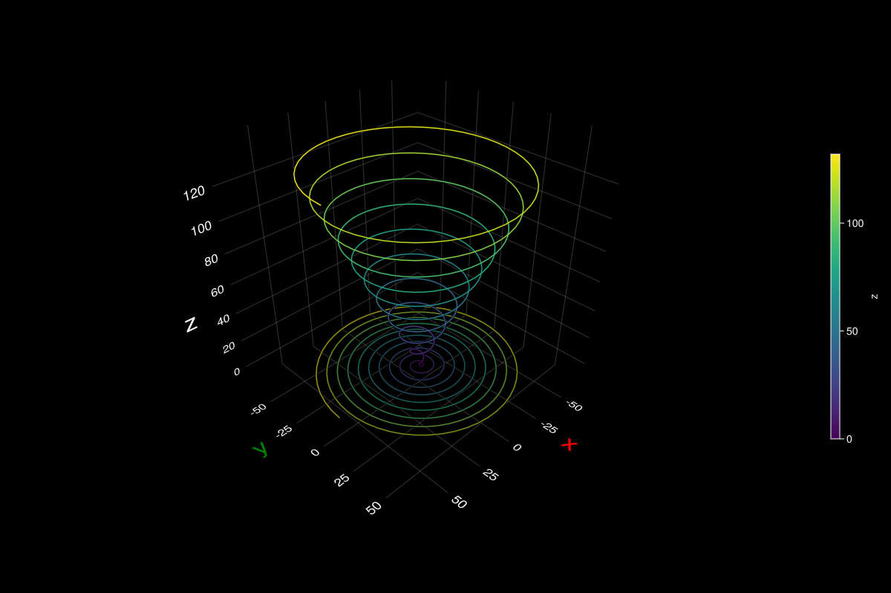

## line: archimedean spiral {#line:-archimedean-spiral}





```julia
using GLMakie
GLMakie.activate!()
GLMakie.closeall() # close any open screen

a, m, z₀ = 1, 2.1, 0
φ = range(0,20π,length=500)
r = a*φ
x, y, z = r .* cos.(φ), r .* sin.(φ), m .* r .+ z₀;

with_theme(theme_black()) do
    fig = Figure(size = (1200, 800))
    ax = LScene(fig[1,1])
    line3d = lines!(x, y, z, color = z, colormap = :viridis)
    lines!(x, y, 0*z, color = z, colormap = (:viridis, 0.65))

    axis = ax.scene[OldAxis]
    axis[:names, :axisnames] = ("x", "y", "z")
    axis[:names, :fontsize] = 10
    axis[:names, :textcolor] = (:red, :green, :white)
    axis[:names, :font] = "helvetica"
    axis[:names, :gap] = 5
    axis[:ticks, :textcolor] = :white
    axis[:ticks, :fontsize] = 5
    Colorbar(fig[1,2], line3d, label = "z",ticklabelsize = 14,
        width = 12, height = Relative(2/4), tickalign=0)
    fig
end
```

