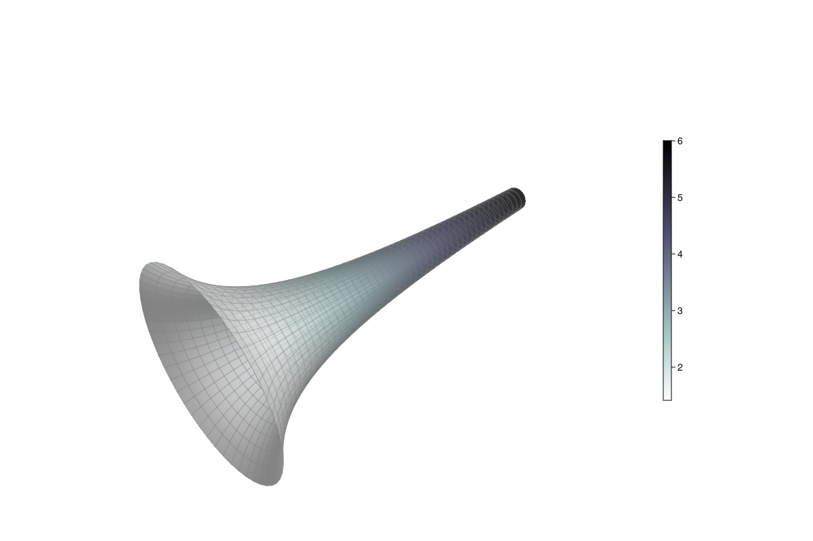

## gabriels horn: surface revolution {#gabriels-horn:-surface-revolution}





```julia
using GLMakie
GLMakie.activate!()
GLMakie.closeall() # close any open screen

u = LinRange(0.8, 6, 50)
v = LinRange(0, 2π, 50)
X1 = [u for u in u, v in v]
Y1 = [(1/u) * cos(v) for u in u, v in v]
Z1 = [(1/u) * sin(v) for u in u, v in v]

fig = Figure(size=(1200, 800))
ax = LScene(fig[1, 1], show_axis=false)
pltobj = surface!(ax, -X1, -Y1, Z1; shading = FastShading,
    #ambient=Vec3f(0.65, 0.65, 0.65),
    backlight=1.0f0, color=sqrt.(X1 .^ 2 .+ Y1 .^ 2 .+ Z1 .^ 2),
    colormap=Reverse(:bone_1), transparency=true,
    )
wireframe!(ax, -X1, -Y1, Z1; transparency = true,
    color = :gray, linewidth = 0.5)
zoom!(ax.scene, cameracontrols(ax.scene), 0.98)
Colorbar(fig[1, 2], pltobj, height=Relative(0.5))
colsize!(fig.layout, 1, Aspect(1, 1.0))
fig
```


```ansi
┌ Warning: `shading = FastShading` is deprecated in favor of `shading = true` as a plot attribute. To switch between `FastShading` and `MultiLightShading` explicitly, use scene attributes.
└ @ Makie ~/.julia/packages/Makie/HyJrI/src/conversions.jl:2353
```

