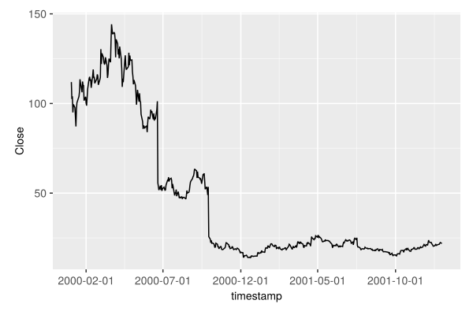
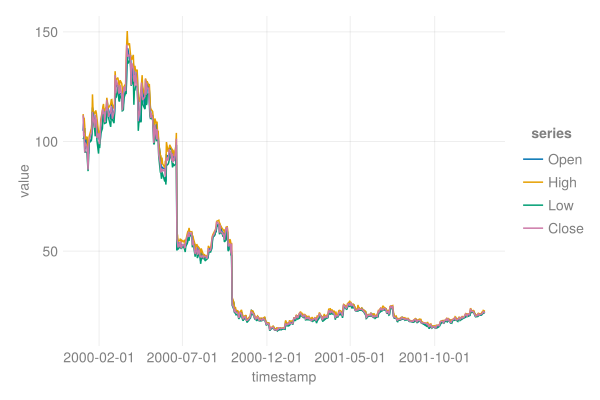
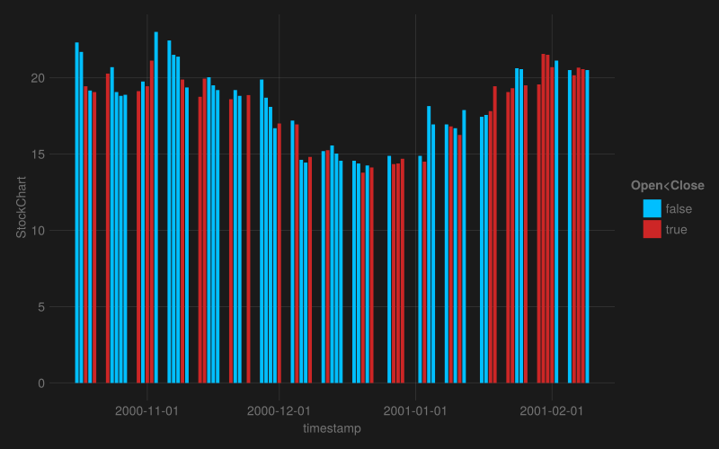

```julia
using MarketData, DataFrames
using AlgebraOfGraphics, CairoMakie
using Statistics
```


## Close Price {#Close-Price}

```julia
plt = data(cl)*mapping(:timestamp, :Close)*visual(Lines)

with_theme(theme_ggplot2(), size = (600,400)) do
    plt |> draw
end
```





## Prices {#Prices}

```julia
labels = [:Open, :High, :Low, :Close]
plt = data(ohlc)
plt *= mapping(:timestamp, labels .=> "value", color =dims(1)=>renamer(labels) => "series ")

with_theme(theme_light(), size = (600,400)) do
    plt * visual(Lines) |> draw
end
```





## StockChart {#StockChart}

```julia
df = DataFrame(ohlc)
pltd = data(df[200:280,:])
plt = pltd * mapping(:timestamp, :Open => "StockChart")
plt *= mapping(color = (:Open, :Close) => isless => "Open<Close") # fillto=:Close, because of this, the plot is wrong
plt *= visual(BarPlot)

with_theme(theme_dark(), size = (800,500)) do
    draw(plt, scales(Color = (; palette = [:deepskyblue, :firebrick3])))
end
```




