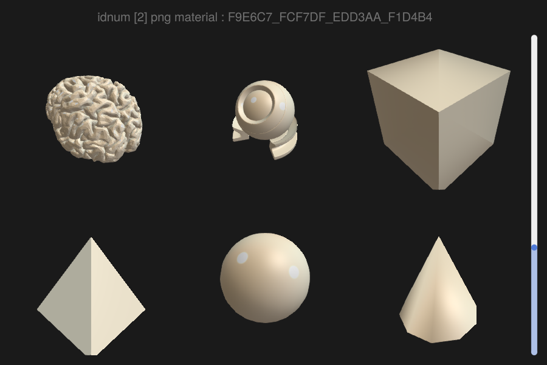

## Mesh with matcap: Slider {#Mesh-with-matcap:-Slider}





```julia
using GLMakie
using FileIO, Downloads, JSON
using Makie.GeometryBasics: Pyramid
using GeometryBasics
using Colors, LinearAlgebra
GLMakie.activate!()
GLMakie.closeall() # close any open screen

pyr = Pyramid(Point3f(0), 1.0f0, 1.0f0)
rectmesh = Rect3(Point3f(-0.5), Vec3f(1))
sphere = Sphere(Point3f(-0.5), 1)
function Kone(; quality = 10)
    # Create base circle points
    base_radius = 0.5f0
    base_points = Point3f[]
    for i in 0:quality-1
        angle = 2π * i / quality
        x = base_radius * cos(angle)
        y = base_radius * sin(angle)
        push!(base_points, Point3f(x, y, 0))
    end

    # Apex point
    apex = Point3f(0, 0, 1)

    # Create faces connecting base to apex
    faces = TriangleFace{Int}[]
    for i in 1:quality
        next_i = (i % quality) + 1
        # Triangle: base point i, base point next, apex
        push!(faces, TriangleFace(i, next_i, quality + 1))
    end
    # Base circle face
    for i in 2:quality-1
        push!(faces, TriangleFace(1, i, i + 1))
    end

    # Combine all points
    all_points = vcat(base_points, [apex])

    return GeometryBasics.Mesh(all_points, faces)
end

cone = Kone()
brain = load(Makie.assetpath("brain.stl"))
matball = load(Makie.assetpath("matball_base.obj"))
matball_inner = load(Makie.assetpath("matball_inner.obj"))
matball_outer = load(Makie.assetpath("matball_outer.obj"))
# download more ids from here:
# https://raw.githubusercontent.com/MakieOrg/BeautifulMakie/main/data/
#ids = JSON.parsefile("matcapIds.json")

ids = ["F79686_FCCBD4_E76644_E76B56",
    "F9E6C7_FCF7DF_EDD3AA_F1D4B4",
    "FBB43F_FBE993_FB552E_FCDD65",
    "FBB82D_FBEDBF_FBDE7D_FB7E05"]
function plotmat()
    idx = Observable(1)
    idpng = @lift(ids[$idx])
    matcap = @lift(load(Downloads.download("https://raw.githubusercontent.com/nidorx/matcaps/master/1024/$($idpng).png")))

    shading = true
    fig = Figure(size=(900, 600))
    axs = [LScene(fig[i, j]; show_axis=false)
            for j in 1:3, i in 1:2]
    mesh!(axs[5], sphere; matcap, shading)
    mesh!(axs[3], rectmesh; matcap, shading, transparency=true)
    mesh!(axs[4], pyr; matcap, shading)
    mesh!(axs[2], matball; matcap, shading)
    mesh!(axs[2], matball_inner; matcap, shading)
    mesh!(axs[2], matball_outer; matcap, shading)
    mesh!(axs[6], cone; matcap, shading)
    mesh!(axs[1], brain; matcap, shading)
    GLMakie.rotate!(axs[2].scene, 2.35)
    center!(axs[2].scene)
    zoom!(axs[2].scene, cameracontrols(axs[2].scene), 0.75)
    zoom!(axs[3].scene, cameracontrols(axs[3].scene), 1.2)
    zoom!(axs[4].scene, cameracontrols(axs[4].scene), 1.2)
    sl = Slider(fig[1:2, 4], range=1:length(ids), startvalue=2, horizontal=false)
    connect!(idx, sl.value)
    fig[0, 1:3] = GLMakie.Label(fig, @lift("idnum [$(1*$idx)] png material : $(ids[$idx])"), fontsize=20,
        tellheight=true, tellwidth=false)
    fig
end
fig = with_theme(plotmat, theme_dark())
```

