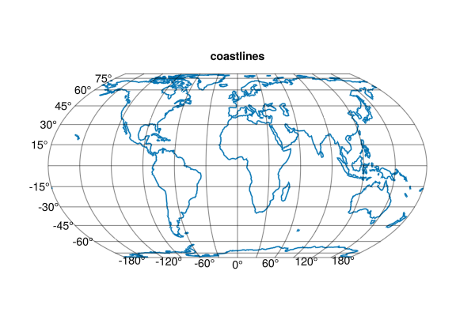

## Coastlines {#Coastlines}





This should create a GeoAxis, then on top we plot the coastlines from from Natural Earth.

```julia
using GLMakie, GeoMakie
GLMakie.activate!()

fig = Figure(; size=(600, 400))
ax = GeoAxis(fig[1, 1]; title="coastlines")
lines!(ax, GeoMakie.coastlines())
fig
```

