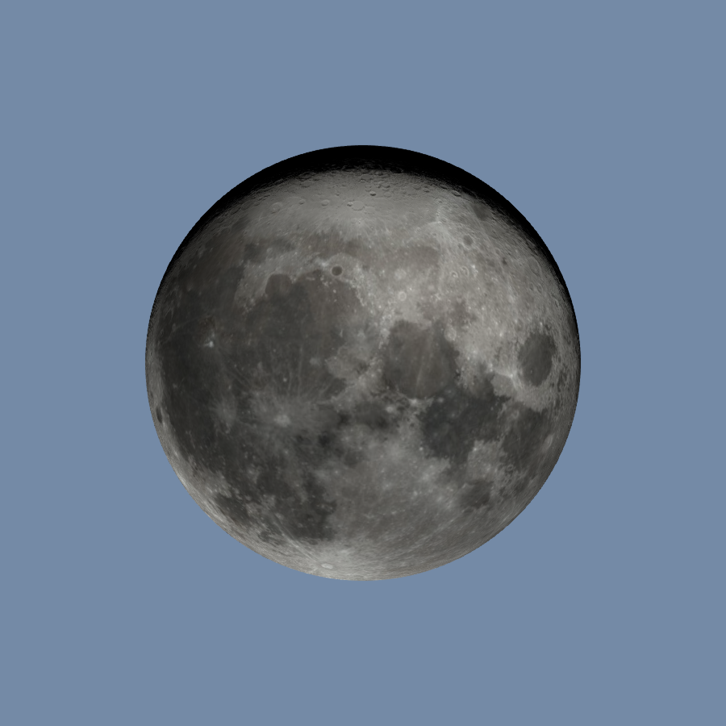

## Moon texture onto a sphere {#Moon-texture-onto-a-sphere}





```julia
using GLMakie, FileIO
using Downloads: download
GLMakie.activate!()

moon = load(download("https://svs.gsfc.nasa.gov/vis/a000000/a004600/a004675/phases.0001_print.jpg"))
n = 1024 # 2048
θ = LinRange(0, pi, n)
φ = LinRange(0, 2 * pi, 2 * n)
x = [cos(φ) * sin(θ) for θ in θ, φ in φ]
y = [sin(φ) * sin(θ) for θ in θ, φ in φ]
z = [cos(θ) for θ in θ, φ in φ]

fig = Figure(size=(900, 900), backgroundcolor="#748AA6")
ax = Axis3(fig, aspect=:data, viewmode=:fitzoom, #perspectiveness = 0.5,
    azimuth=0.01π, elevation=0.85π,)
surface!(ax, x, y, z;
    color=moon,
    shading = FastShading,
    backlight=1.5f0
    )
hidedecorations!(ax)
hidespines!(ax)
fig[1, 1] = ax
fig
```


```ansi
┌ Warning: `shading = FastShading` is deprecated in favor of `shading = true` as a plot attribute. To switch between `FastShading` and `MultiLightShading` explicitly, use scene attributes.
└ @ Makie ~/.julia/packages/Makie/HyJrI/src/conversions.jl:2353
```

